# Ngwe Lwe System Flow

This document summarizes the runtime and business flow of the Ngwe Lwe System as implemented in the current project.

## System Overview

Ngwe Lwe is a PyQt6 desktop money-transfer application backed by a FastAPI server and SQLite database. The desktop client can either host a local backend or connect to a LAN backend. Users authenticate through the API, receive role-specific desktop screens, and perform account, transaction, vault, float, reporting, and administration workflows.

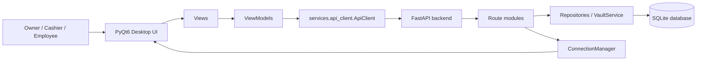

## Main Runtime Flow

The unified launcher in `main.py` decides whether this machine should host the server or connect as a client. In host mode it starts Uvicorn in a background Qt thread, waits for `/health`, then opens the login view. In client mode it reads saved host settings, checks the remote server, and lets the user change the server if needed.

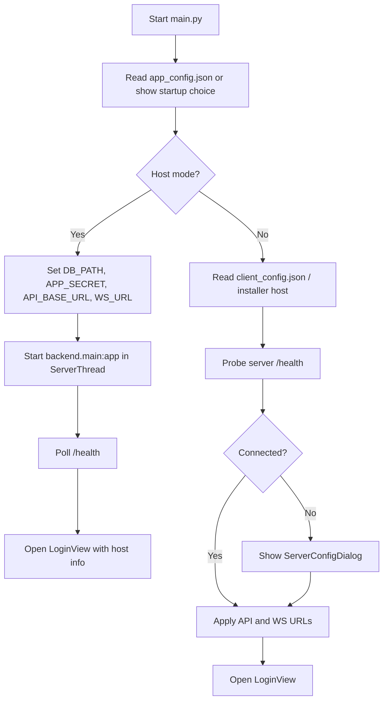

There is also a standalone server manager in `run_server_app.py` that lets an admin configure host and port, start or stop the Uvicorn backend, and view server logs.

## Authentication And Role Flow

Authentication is handled by `POST /auth/login`. The backend validates credentials, returns a HMAC-SHA256 bearer token, and the desktop stores the token in `ApiClient`. After login, `LoginView` opens a role-specific window.

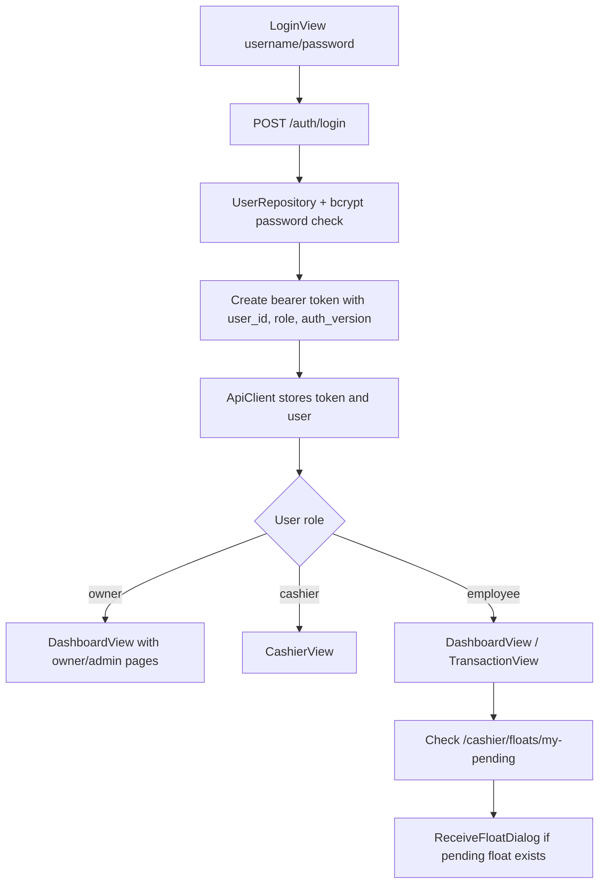

Every protected API request passes through `backend.auth.get_current_user()`. Role checks are enforced in route modules such as `transactions.py`, `cashier.py`, `users.py`, and the owner-only administration routes.

## API And Persistence Flow

The FastAPI app is assembled in `backend/main.py`. On startup it ensures logo storage exists, initializes and migrates the database, creates a shared WebSocket `ConnectionManager`, and includes all route modules.

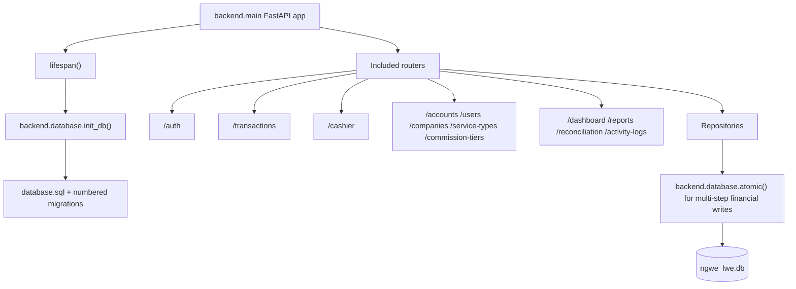

Important persistence tables include `users`, `companies`, `service_types`, `accounts`, `transactions`, `commission_tiers`, `exchange_rates`, `cash_float_assignments`, `cash_float_denominations`, `cash_denomination_logs`, `vault_denomination_balances`, `transaction_payment_denominations`, `daily_reconciliation_logs`, and `activity_logs`.

## WebSocket Refresh Flow

Real-time updates use a short-lived one-time WebSocket ticket instead of placing the bearer token in the WebSocket URL.

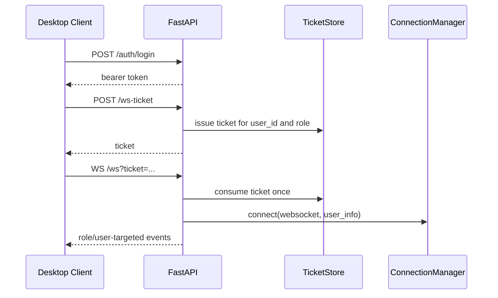

Routes publish events through `ConnectionManager` after important state changes. Examples include `cash_in_pending`, `cash_in_confirmed`, `cash_in_cancelled`, `pending_cash_in_update`, `new_transaction`, `balance_update`, `float_issued`, `float_received`, `float_return_initiated`, `float_return_confirmed`, `float_update`, `transaction_approved`, and `transaction_payment_recorded`.

## Transaction Creation Flow

Employees and owners create normal transactions through `/transactions`. Cashiers are blocked from creating normal transactions. Employees must have an active cash float before creating cash-impacting transaction records.

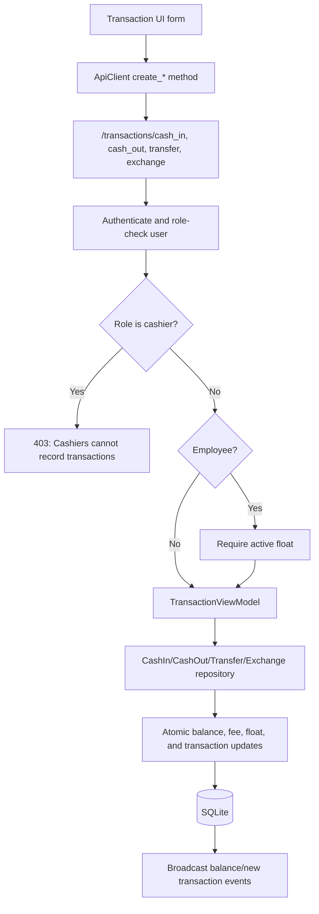

The transaction repositories share common logic in `TransactionOperationBase`: amount validation, fee tier lookup, server-side fee resolution, employee float validation, fee account updates, audit logging, and MMK fee rounding.

## Cash In Flow

Cash In is a two-step workflow. The employee records the digital movement first, then a cashier confirms the physical cash with PIN and denominations.

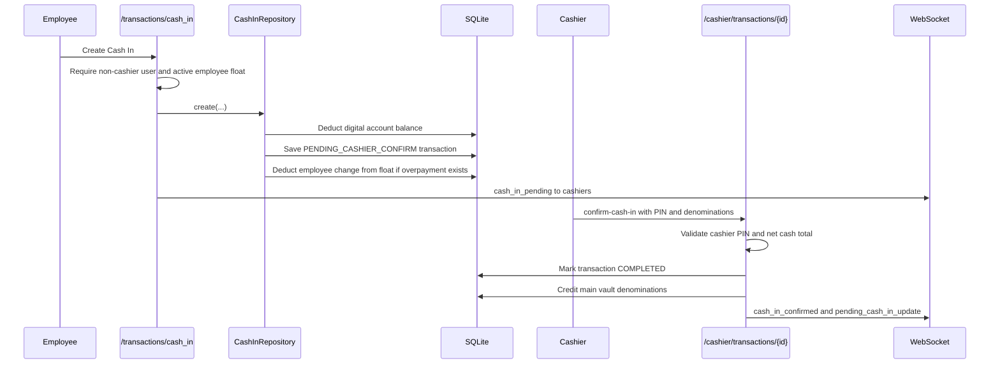

If the cashier cancels a pending Cash In, `CashInRepository.cancel_pending_cash_in()` reverses the digital account deduction inside an atomic transaction before marking the transaction cancelled. If the reversal cannot be applied safely, the cancellation fails and the transaction remains pending.

## Cash Out, Transfer, And Exchange Flow

Cash Out, Transfer, and Exchange complete through their respective transaction repositories. The backend calculates fees from commission tiers and updates balances inside atomic transactions.

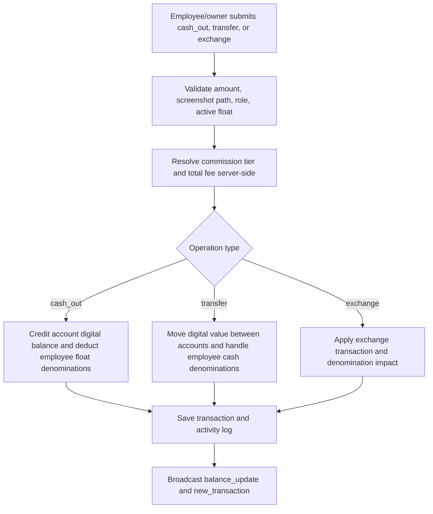

## Cash Float Lifecycle

The cashier manages the main vault and issues floats to employees. Employees must receive a float with PIN and denomination verification before they can use it.

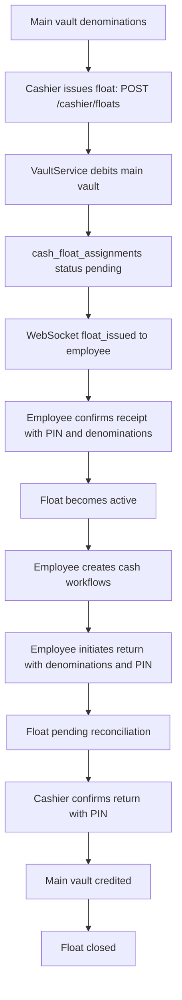

`VaultService` and `CashFloatRepository` guard denomination mismatches, insufficient denomination balances, invalid float state transitions, and atomic vault/float updates.

## Cashier Vault And Approval Flow

Cashier routes are centered around physical cash control: main vault entries, pending Cash In confirmation, transaction cash approval, and fee payment with change.

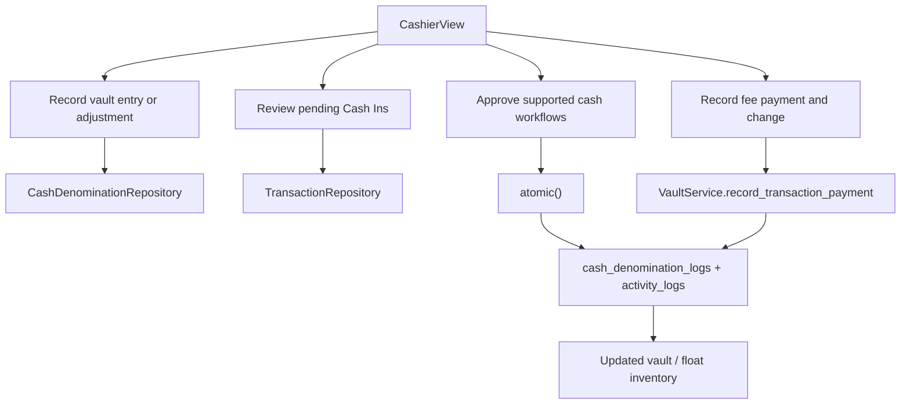

Cashier PIN checks are rate-limited for high-risk actions such as receiving returns, confirming Cash In, cancelling Cash In, and employee float receipt/return flows.

## Administration And Reporting Flow

Owners use dashboard and settings screens to manage system reference data and reporting.

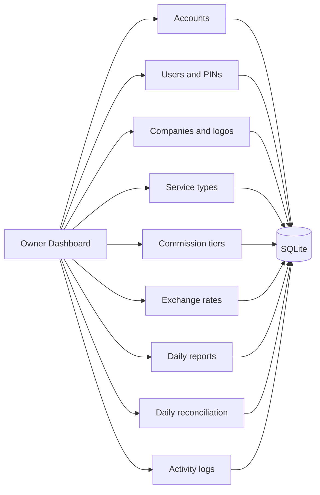

Administrative routes use repository classes such as `AccountRepository`, `UserRepository`, `CompanyRepository`, `ServiceTypeRepository`, `CommissionTierRepository`, `ExchangeRateRepository`, `DailyReconciliationRepository`, and `TransactionRepository`.

## Security And Data Integrity Flow

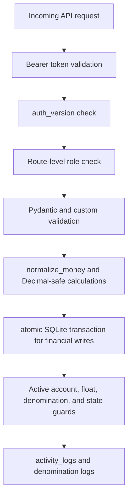

Key controls include strong `APP_SECRET`, bcrypt password/PIN hashing, login and PIN rate limiting, short-lived one-use WebSocket tickets, disabled hard deletes for financial transactions, screenshot path validation, active-account balance updates, denomination validation, and atomic repository-level financial writes.

## High-Level Module Map

| Area | Main files |
| --- | --- |
| Desktop startup | `main.py`, `run_server_app.py` |
| API app | `backend/main.py` |
| Auth/security | `backend/auth.py`, `backend/security_policy.py`, `backend/rate_limit.py` |
| WebSocket | `backend/websocket_manager.py` |
| Routes | `backend/routes/*.py` |
| Database | `backend/database.py`, `backend/database.sql`, `ngwe_lwe.db` |
| Domain models | `models/*.py` |
| Business persistence | `repositories/*.py` |
| Desktop API bridge | `services/api_client.py` |
| Vault operations | `services/vault_service.py` |
| UI orchestration | `viewmodels/*.py` |
| Desktop screens | `views/*.py`, `views/ui/*.py`, `views/settings/*.py` |
| Tests | `tests/*.py` |
